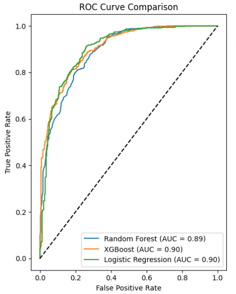
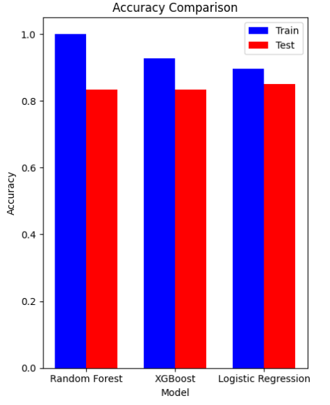
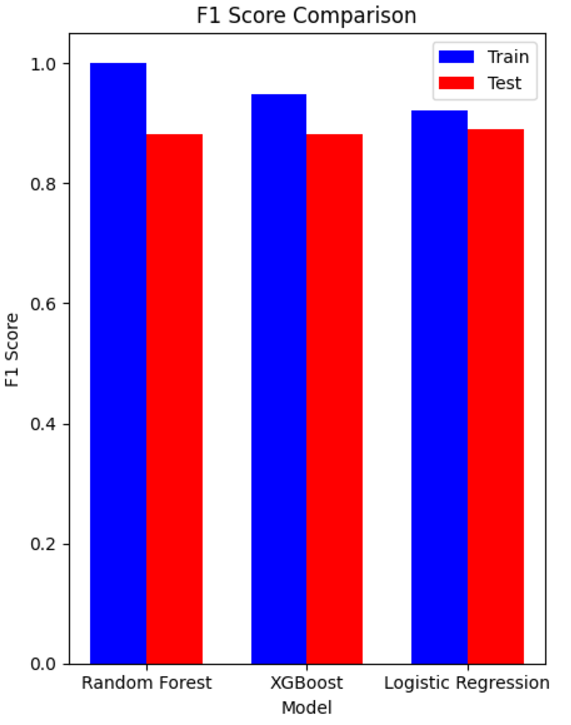

# Team 125: ChartTopperAI

Project Final
---

[Team 125 Timeline and Responsibility Chart](https://docs.google.com/spreadsheets/d/1BAeCRSATNG66czkyHXANuw6V8RqQEYm4ZzUVjBAZx54/edit?usp=sharing)

## Proposal, Midterm, and Final Contributions

|Member               |Contributions                                      |
|---------------------|---------------------------------------------------|
|Eric Guenoun         |Gantt Chart                                        |
|Vinay Halwan         |Proposal Section 2 & 4 & Processing Data           |
|Tripp Hanley         |Proposal Section 1 & Scraping and Cleaning Data    |
|Brandon Harris       |Presentation & Video                               |
|Michael Herndon III  |Proposal Section 3 & Model Creation                |

## Introduction & Background

For our project, we will create an accessible model for a song’s outreach and popularity through audio features and marketing. Some experimental models exist already, such as an MLP finding a statistically significant correlation with loudness and duration [[1]](#references). Other studies found that audio features are only a small factor, as an audio-based GNB model only had 60% accuracy, identifying artist and genre data as a potential future feature [[2]](#references). For our training data, Spotify’s existing API analyzes and provides audio data such as ‘danceability’ and tempo scores along with genre data that can be compiled to a dataset for our model to learn and use. We will also follow Reiman and include genre and artist data to explore if genre changes success rate.

## Problem Definition

Predicting a music’s success is incredibly difficult within the increasingly complex, fast-paced music industry landscape that exists today. Many current models are dependent on subjective evaluations, thereby creating erratic results and sidelining emerging talent. The unpredictability can pose challenges to artists striving to reach the audience effectively. As streaming platforms are transforming the landscape of music, a data driven approach is important for understanding the interplay of various factors like audio characteristics and listener preferences. Using machine learning techniques will allow us to increase prediction accuracy and foster a diverse space for artists seeking recognition.

## Methods

Before building an accurate model for our data, we had to locate a dataset to use. Immediately one that stood out was [this one by MaharshiPandya on Kaggle](https://www.kaggle.com/datasets/maharshipandya/-spotify-tracks-dataset). Although this provides a great starting point to begin testing models, the dataset is fairly limiting. In that dataset, most of the songs are over 1,000,000 listens or are well-known artists. Although that is typical for a mid-sized artist, we want our model to focus on the success of small artists. To resolve this issue, we created our own dataset that removes the bias towards and instead favors smaller songs that could reveal features with higher variance. Because spotify does not support a graph-like structure with the recommendation api, we had to pivot towards using a single large playlist. When this happened though, it tended to favor large artists which was the issue with the previous dataset. Finally, we settled on making a webscraper that has over 1,000 genres of music hardcoded and it would choose a random playlist from the 850 queried based on the genre and scrape 50 songs from it. With this approach, we received a far greater number of smaller songs. Another effect was the removal of cultural bias. In the first two iterations of the scraper, there was a heavy bias towards English-Speaking artists, as that is the majority of Spotify's user base due to the single playlist being used or scraping top search results. With the new playlist search feature the scraper was scraping data from obscure genres from traditional Zulu to Mongolian to Horrorcore. The last hurdle we had to overcome was the rate-limit. Unlike other APIs, Spotify uses a sliding window 30 second rate-limit. This means we had to spread out our queries and combine them. The current scraper avoids the rate limit by having a write buffer and numerous threads, where 50 songs are queried at once then returned to the buffer. Once the buffer is at capacity, the fastcsv package asynchronously writes to [our csv file dataset found here](https://drive.google.com/file/d/1UziZiIdvaWGnPYy869o9lhL2ziR87zQh/view?usp=sharing). With the webscraping complete, the data needed to be cleaned.

To build an accurate model for predicting song success on streaming platforms, effective data preprocessing is essential. Numerical features such as danceability, energy, valence, tempo, etc. are standardized using Scikit-learn’s StandardScaler, ensuring that the varying scales of these features do not negatively impact the model’s performance. For categorical variables such as song genre, one-hot encoding was employed to convert them into numerical representations that can be used by machine learning algorithms. Additionally, to avoid overfitting and improve performance, we applied SelectKBest to reduce the dimensionality of the dataset by selecting the most relevant features. Features from the data such as artist, song name, and popularity will ultimately be ignored since this will introduce a significant amount of bias into the model.

After preprocessing, we intend to experiment with several machine learning models. Logistic regression will serve as a baseline for predicting targets such as the song being a hit or not. Random forests, implemented through RandomForestClassifier, are well-suited for our data because they can handle both numerical and categorical variables without explicit encoding [[3]](#references). To further improve accuracy, especially in datasets where relationships are non-linear, we will use XGBoost, which builds trees sequentially to correct errors made by earlier trees [[4]](#references).

For our supervised learning approach, we focus primarily on ensemble methods, which are especially useful for handling complex, non-linear data [[5]](#references) [[6]](#references). In addition, we will use logistic regression for binary classification tasks, such as predicting whether a song will become a hit or not. This combination of preprocessing and model experimentation should provide a strong foundation for predicting song success.

## Results and Discussion

The primary goal of this project is to create a machine learning model that’s capable of predicting the success of a song. It’ll utilize key metrics like accuracy, f1 score, and area under the ROC curve. We desire in achieving an f1 score of at least 0.8, and an AUC-ROC score that exceeds 0.85 to show a strong balance between recall and precision as to highlight the model’s abilities to distinguish between successful and unsuccessful tracks. We are also committed towards ethical considerations by addressing biases of genre, artist popularity, and other subjective factors. Our expectation is that the model will deliver a high predictive accuracy while encouraging a range of artistic expression.

    

<h3>Random Forest</h3>
The Random Forest model achieved an AUC of 0.89, which indicates a good ability to distinguish between positive (successful songs) and negative (unsuccessful songs) classes. However, it is slightly lower than the AUCs of the other models, which suggests that it may not have captured certain nuances in the data as effectively.

The ROC curve for Random Forest shows a relatively high True Positive Rate but also a higher False Positive Rate compared to XGBoost and Logistic Regression. This tradeoff implies that while the model is capable of identifying many true positives, it also incorrectly classifies a higher number of negative cases as positive. This can be attributed to the overfitting that was observed in the accuracy analysis—since the Random Forest is so highly tuned to the training data, it tends to classify borderline or ambiguous cases as positive, leading to a higher FPR.

The AUC value of 0.89 is still a strong indicator of performance, suggesting that the model does perform well in distinguishing between the two classes in general. However, the slight reduction in AUC compared to other models indicates that further tuning may be required to improve its generalization.

<h3>XGBoost</h3>
The XGBoost model has an AUC of 0.90, the same as the Logistic Regression model and slightly better than the Random Forest model. This high AUC indicates that XGBoost is effective at distinguishing between successful and unsuccessful songs, with a good balance between True Positive Rate and False Positive Rate.

The ROC curve for XGBoost lies above that of Random Forest, especially at lower False Positive Rates, showing that XGBoost has a better ability to correctly classify true positives while keeping false positives low. This can be attributed to the gradient boosting mechanism used by XGBoost, which builds trees sequentially and focuses on correcting the mistakes made by the previous trees. This allows XGBoost to optimize for difficult cases and achieve a more accurate separation of classes, as demonstrated by the higher AUC.

The slight advantage of XGBoost over Random Forest can also be attributed to its regularization features (lambda and alpha), which prevent overfitting by penalizing complex models. This balance allows XGBoost to achieve a better AUC while maintaining generalizability, which was also reflected in the accuracy analysis.

<h3>Logistic Regression</h3>
Logistic Regression also achieved an AUC of 0.90, comparable to XGBoost. The ROC curve for Logistic Regression shows that the model performs well at distinguishing between the two classes, with a curve similar to XGBoost. The consistent performance across metrics such as AUC, accuracy, and F1 score suggests that Logistic Regression is well-suited for this problem.

The high AUC of Logistic Regression implies that the linear decision boundary it creates is effective at separating successful from unsuccessful songs. The similarity between the Logistic Regression and XGBoost ROC curves suggests that the relationships within the data are largely linear or can be approximated well by a linear model.

    

<h3>Random Forest</h3>
The Random Forest model exhibited high training accuracy, reaching nearly 100%. This outcome indicates that the model perfectly or almost perfectly classified the training data. Such high accuracy suggests that the Random Forest has a great ability to learn from the training set by effectively identifying and memorizing patterns in the provided features. However, the training accuracy alone is not sufficient to conclude that the model is performing well in a general sense.

When evaluated on the test data, the Random Forest's accuracy decreased significantly. This drop implies that the model has overfitted on the training data—it has learned too many details and noise, making it less flexible when dealing with new data points that it hasn't seen before. The gap between training and testing accuracy is a classic indicator of overfitting, where the model performs exceptionally well on familiar data but struggles with data that represents real-world, unseen scenarios.

Overfitting in Random Forest is often due to its intrinsic ability to create highly complex structures by utilizing deep decision trees. In this case, the Random Forest model likely learned unique attributes of individual training samples, resulting in high accuracy in training but reduced ability to generalize, as evidenced by its lower test accuracy. To address this overfitting, one might consider reducing the depth of trees, increasing the minimum number of samples per leaf, or using fewer features for each split.

<h3>XGBoost</h3>
The XGBoost model shows a more balanced accuracy between training and testing datasets. The training accuracy, while high, does not reach the extreme value seen in the Random Forest. Importantly, the test accuracy is relatively close to the training accuracy, indicating that XGBoost has a good ability to generalize.

This balance suggests that XGBoost, unlike Random Forest, has not memorized the training data but has instead learned generalizable patterns. The consistency between training and testing accuracy shows that XGBoost's built-in regularization techniques, such as L1 and L2 regularization, help control overfitting by penalizing overly complex models. Moreover, XGBoost uses gradient boosting, where trees are built sequentially, and each tree attempts to correct the errors made by the previous ones. This helps the model capture nuanced relationships without losing generalization ability.

<h3>Logistic Regression</h3>
In the case of the training data, Logistic Regression's accuracy was slightly lower than the other models, which is expected given its simpler nature. The model does not try to fit every data point precisely, which means it won’t achieve as high a training accuracy as the more complex Random Forest or XGBoost. However, when evaluated on the test set, the accuracy of Logistic Regression was quite close to its training accuracy, demonstrating that the model generalizes well to unseen data.

The consistency in training and test accuracies for Logistic Regression indicates that the model has captured a meaningful, generalizable relationship between the features and the target variable without overfitting to the training data. Logistic Regression is effective when the underlying relationship between the features and the target is approximately linear, which appears to be true in this case.

    

<h3>Random Forest</h3>
The Random Forest model has a very high training F1 score, close to 1.0, which once again suggests overfitting. The model effectively learns almost all the training data perfectly, which is reflected in the nearly perfect F1 score for the training set. However, when evaluating the model on the test data, the F1 score drops significantly. This disparity between training and test F1 scores is a classic sign of overfitting, where the model has learned the intricacies and noise of the training data to the extent that it struggles to generalize to new data.

The high training F1 score indicates that the Random Forest has high precision and recall on the training data, meaning that it correctly classifies most positive samples while also minimizing false positives. However, the drop in the test F1 score shows that this precision and recall do not carry over to unseen data, reducing the reliability of the model for real-world use.

<h3>XGBoost</h3>
XGBoost shows a more balanced F1 score between the training and testing datasets. The training F1 score is high, but not excessively so, and the test F1 score is only slightly lower. This consistency suggests that XGBoost has managed to effectively learn the patterns in the training data while avoiding overfitting.

The balanced F1 score indicates that XGBoost is capable of effectively managing both false positives and false negatives, making it a robust model for this classification problem where both types of errors are important to minimize.

<h3>Logistic Regression</h3>
Logistic Regression demonstrated similar F1 scores for both training and test datasets, suggesting good generalization capabilities. The training F1 score is slightly lower compared to Random Forest and XGBoost, which is expected due to the simpler, linear nature of Logistic Regression. However, the test F1 score is consistent with the training score, indicating that the model did not overfit and is generalizing well to unseen data.

<h2>Strengths, Limitations, Tradeoffs</h2>

**Random Forest**: The main strength of Random Forest lies in its ability to capture complex relationships within the data due to its flexibility. However, the downside is the tendency to overfit, especially when hyperparameters are not carefully regularized. This model's training metrics are high, but the significant drop in test metrics indicates it may have learned noise or specifics of the training data, reducing its predictive power for unseen examples.

**XGBoost**: XGBoost proved to be a strong contender, showing consistent performance across training and test datasets. The built-in regularization mechanisms help to prevent overfitting, which explains why XGBoost's metrics are similar for both training and test sets. The complexity of XGBoost and its ability to capture subtle patterns make it a powerful model for this task, though it is computationally intensive compared to Logistic Regression.

**Logistic Regression**: Logistic Regression performed comparably to XGBoost, with high consistency between training and test metrics. As a simpler model, it is less prone to overfitting and is easier to interpret. The downside is that Logistic Regression may struggle to capture non-linear relationships as effectively as more complex models like XGBoost or Random Forest. Despite this limitation, its performance in this scenario is notable, indicating that the dataset's relationships may be sufficiently linear for Logistic Regression to perform well.

## Video and Presentation for Proposal
- [Video](https://youtu.be/5eBhSzQKD0U)
- [Presentation](https://docs.google.com/presentation/d/18zIXuh5MFcKSHXZa84NbpHkGcrnm5MaotNsH93NmArI/edit?usp=sharing)

## References

[1] “[PDF] Collaboration-Aware Hit Song Prediction | Semantic Scholar,” Semanticscholar.org, 2023. https://www.semanticscholar.org/reader/fe52aade53722e81d8dda2e0093e0ef4b9d56799 (accessed Oct. 04, 2024).

[2] M. Reiman, P. Örnell, K. Skolan, F. Elektroteknik, and O. Datavetenskap, “Predicting Hit Songs with Machine Learning.” Accessed: Aug. 02, 2022. [Online]. Available: https://kth.diva-portal.org/smash/get/diva2:1214146/FULLTEXT01.pdf

[3] L. Breiman, “Random Forests,” Machine Learning, vol. 45, no. 1, pp. 5–32, 2001, doi: https://doi.org/10.1023/a:1010933404324.

[4] T. Chen and C. Guestrin, “XGBoost: a Scalable Tree Boosting System,” Proceedings of the 22nd ACM SIGKDD International Conference on Knowledge Discovery and Data Mining - KDD ’16, pp. 785–794, 2016., doi: https://dl.acm.org/doi/pdf/10.1145/2939672.2939785

[5] T. G. Dietterich, “Ensemble Methods in Machine Learning,” Multiple Classifier Systems, vol. 1857, pp. 1–15, 2000, doi: https://doi.org/10.1007/3-540-45014-9_1.

[6] Z. Zhou, “Ensemble Methods: Foundations and Algorithms,” 2012. https://tjzhifei.github.io/links/EMFA.pdf (accessed Oct. 04, 2024).
‌
‌
‌
‌
