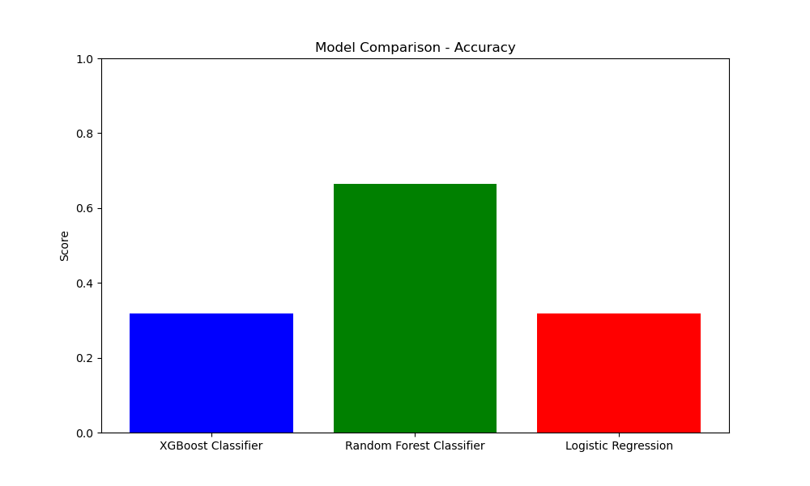

# Team 125: ChartTopperAI

Project Proposal
---

[Team 125 Timeline and Responsibility Chart](https://docs.google.com/spreadsheets/d/1BAeCRSATNG66czkyHXANuw6V8RqQEYm4ZzUVjBAZx54/edit?usp=sharing)

## Proposal Contributions

|Member               |Contribution            |
|---------------------|------------------------|
|Eric Guenoun         |Gantt Chart             |
|Vinay Halwan         |Proposal Section 2 & 4  |
|Tripp Hanley         |Proposal Section 1      |
|Brandon Harris       |Presentation & Video    |
|Michael Herndon III  |Proposal Section 3      |

## Introduction & Background

For our project, we will create an accessible model for a song’s outreach and popularity through audio features and marketing. Some experimental models exist already, such as an MLP finding a statistically significant correlation with loudness and duration [[1]](#references). Other studies found that audio features are only a small factor, as an audio-based GNB model only had 60% accuracy, identifying artist and genre data as a potential future feature [[2]](#references). For our training data, Spotify’s existing API analyzes and provides audio data such as ‘danceability’ and tempo scores along with genre data that can be compiled to a dataset for our model to learn and use. We will also follow Reiman and include genre and artist data to explore if genre changes success rate.

## Problem Definition

Predicting a music’s success is incredibly difficult within the increasingly complex, fast-paced music industry landscape that exists today. Many current models are dependent on subjective evaluations, thereby creating erratic results and sidelining emerging talent. The unpredictability can pose challenges to artists striving to reach the audience effectively. As streaming platforms are transforming the landscape of music, a data driven approach is important for understanding the interplay of various factors like audio characteristics and listener preferences. Using machine learning techniques will allow us to increase prediction accuracy and foster a diverse space for artists seeking recognition.

## Methods

To build an accurate model for predicting song success on streaming platforms, effective data preprocessing is essential. First, we plan to standardize the numerical features such as danceability, energy, valence, tempo, etc. using Scikit-learn’s StandardScaler, ensuring that the varying scales of these features do not negatively impact the model’s performance. For categorical variables such as song genre, we will use one-hot encoding to convert them into numerical representations that can be used by machine learning algorithms. Additionally, to avoid overfitting and improve performance, we will apply SelectKBest to reduce the dimensionality of the dataset by selecting the most relevant features. Features from the data such as artist, song name, and popularity will ultimately be ignored since this will introduce a significant amount of bias into the model.

After preprocessing, we intend to experiment with several machine learning models. Linear regression will serve as a baseline for predicting continuous targets like the number of streams. Random forests, implemented through RandomForestClassifier, are well-suited for our data because they can handle both numerical and categorical variables without explicit encoding [[3]](#references). To further improve accuracy, especially in datasets where relationships are non-linear, we will use XGBoost, which builds trees sequentially to correct errors made by earlier trees [[4]](#references).

For our supervised learning approach, we plan to focus primarily on ensemble methods, which are especially useful for handling complex, non-linear data [[5]](#references) [[6]](#references). In addition, we will use logistic regression for binary classification tasks, such as predicting whether a song will become a hit or not. This combination of preprocessing and model experimentation should provide a strong foundation for predicting song success.

## Results and Discussion

The primary goal of this project is to create a machine learning model that’s capable of predicting the success of a song. It’ll utilize key metrics like accuracy, f1 score, and area under the ROC curve. We desire in achieving an f1 score of at least 0.8, and an AUC-ROC score that exceeds 0.85 to show a strong balance between recall and precision as to highlight the model’s abilities to distinguish between successful and unsuccessful tracks. We are also committed towards ethical considerations by addressing biases of genre, artist popularity, and other subjective factors. Our expectation is that the model will deliver a high predictive accuracy while encouraging a range of artistic expression.

  
The ROC curve shows that Random Forest has the highest Area Under the Curve (AUC) at 0.68, followed by XGBoost at 0.63, while Logistic Regression lags behind with an AUC of 0.50, which is equivalent to random guessing. Random Forest’s relatively higher AUC suggests that it effectively distinguishes between positive and negative classes by capturing the underlying non-linear relationships in the dataset. However, the AUC is still far from perfect, implying that there is room for improvement, possibly through hyperparameter tuning to optimize the model further. XGBoost’s AUC is suboptimal, likely due to a lack of appropriate hyperparameter tuning. XGBoost’s performance is highly dependent on parameters such as the learning rate, tree depth, and the number of boosting rounds. Without careful tuning, the model may fail to capture the important patterns needed to differentiate between classes effectively.  

Logistic Regression performs poorly with an AUC close to 0.50, indicating that it has no differentiating power between classes and is essentially guessing. We assume this is because Logistic Regression assumes a linear boundary between classes, which is not well-suited to the non-linear relationships present in this data. To improve the models, feature engineering such as introducing non-linear features or interaction terms could help Logistic Regression better approximate the decision boundary. Additionally, using cross-validation would help ensure that the models generalize well to unseen data. Finally, optimizing hyperparameters for XGBoost could lead to a significant improvement in its ability to capture relevant patterns and improve its AUC.  

  
The accuracy chart shows that the Random Forest Classifier outperforms both XGBoost and Logistic Regression significantly, with an accuracy close to 0.70, compared to XGBoost and Logistic Regression, which have accuracies around 0.30. Random Forest performs well because of its ensemble nature, which combines multiple decision trees to improve prediction accuracy by reducing overfitting and increasing robustness against noisy features. Additionally, Random Forest captures non-linear relationships effectively, which likely exist in this dataset. XGBoost, on the other hand, underperforms mainly due to the lack of hyperparameter tuning. As XGBoost is highly sensitive to settings like the learning rate, depth of trees, and the number of estimators, the default settings might not be optimal for this data. The moderate accuracy for XGBoost may also be influenced by the presence of class imbalance, which causes the model to favor the majority class.  

Logistic Regression performs poorly because it assumes a linear relationship between features and the target, and if the underlying relationships are non-linear, it fails to model them accurately. Moreover, without feature scaling, Logistic Regression may struggle with assigning appropriate weights to features with different magnitudes, leading to suboptimal performance. To improve Random Forest further, hyperparameter tuning could be employed to enhance its performance while preventing overfitting. XGBoost requires careful hyperparameter tuning and cross-validation to perform better, while Logistic Regression could benefit from scaling the features and introducing polynomial features to better capture non-linear relationships.

The F1 score chart reveals that Random Forest has a high F1 score of nearly 0.9, while XGBoost and Logistic Regression have almost negligible F1 scores. Random Forest’s high F1 score indicates that it effectively balances both precision and recall, minimizing false positives and false negatives. This suggests that Random Forest is capable of detecting positive and negative labels with similar effectiveness, which may be due to its ability to capture the class distribution well through its ensemble approach. In contrast, both XGBoost and Logistic Regression struggle with a very low F1 score, suggesting that they are unable to effectively balance precision and recall, which might be due to class imbalance in the dataset. When there is an imbalance, models can become biased toward predicting the majority class, which leads to poor recall for the minority class and, consequently, a low F1 score. Additionally, XGBoost and Logistic Regression use a default probability threshold of 0.5 for classification, which may not be ideal given the imbalance, further degrading their F1 scores.  '

To address these issues, adjusting the decision threshold could help increase the F1 scores for both XGBoost and Logistic Regression. Random Forest could be further verified through cross-validation to ensure the high F1 score is not due to overfitting. Lastly, more feature engineering, such as creating interaction terms, may help the models improve their recall and precision balance.

## Video and Presentation
- [Video](https://youtu.be/5eBhSzQKD0U)
- [Presentation](https://docs.google.com/presentation/d/18zIXuh5MFcKSHXZa84NbpHkGcrnm5MaotNsH93NmArI/edit?usp=sharing)

## References

[1] “[PDF] Collaboration-Aware Hit Song Prediction | Semantic Scholar,” Semanticscholar.org, 2023. https://www.semanticscholar.org/reader/fe52aade53722e81d8dda2e0093e0ef4b9d56799 (accessed Oct. 04, 2024).

[2] M. Reiman, P. Örnell, K. Skolan, F. Elektroteknik, and O. Datavetenskap, “Predicting Hit Songs with Machine Learning.” Accessed: Aug. 02, 2022. [Online]. Available: https://kth.diva-portal.org/smash/get/diva2:1214146/FULLTEXT01.pdf

[3] L. Breiman, “Random Forests,” Machine Learning, vol. 45, no. 1, pp. 5–32, 2001, doi: https://doi.org/10.1023/a:1010933404324.

[4] T. Chen and C. Guestrin, “XGBoost: a Scalable Tree Boosting System,” Proceedings of the 22nd ACM SIGKDD International Conference on Knowledge Discovery and Data Mining - KDD ’16, pp. 785–794, 2016., doi: https://dl.acm.org/doi/pdf/10.1145/2939672.2939785

[5] T. G. Dietterich, “Ensemble Methods in Machine Learning,” Multiple Classifier Systems, vol. 1857, pp. 1–15, 2000, doi: https://doi.org/10.1007/3-540-45014-9_1.

[6] Z. Zhou, “Ensemble Methods: Foundations and Algorithms,” 2012. https://tjzhifei.github.io/links/EMFA.pdf (accessed Oct. 04, 2024).
‌
‌
‌
‌
